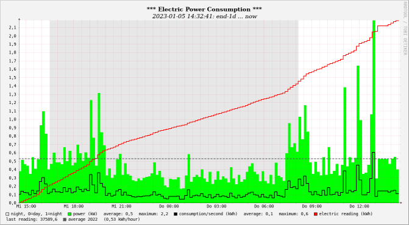

<!-- use sgmlproc for generating a html file -->

# read_62056-21_Meter

contains of a Linux bash script that reads data from an electricity meter via 
an infrared interface, extracts OBIS values and passes them to subsequent 
programs for processing and/or storage.

The entry side is supplier and meter independent. It supports all meters 
complying with the
[IEC 62056-21 specification](https://www.ungelesen.net/protagWork/media/downloads/solar-steuerung/iec62056-21%7Bed1.0%7Den_.pdf),
modes A till D with ASCII output. Mode E is not supported. SML with binary output
is also not supported.

The exit side naturally depends on the desired data and the type of further 
processing. This script takes the meter readings, extracts OBIS values and can
 
- store the data into a local round-robin database using RRDtool-commands
- forward the data to a remote round-robin database using 
[RRDTool_API](https://github.com/piet66-peb/RRDTool_API)
- forward the data to Z-Way virtual device(s) using curl

It can be easily adapted for other purposes.

RRDtool is not only a database software, it also provides a graphing function. 
It could look like this:

## Requirements

A meter reader with an infrared interface (IEC/EN/DIN EN 61107, formerly 1107) 
using the international standard protocol IEC/EN/DIN EN 62056-21 modes A,B,C or D
providing a printable output (plain text, no binary output) with OBIS codes (IEC 62056-61), 
a USB infrared optohead cable and a Linux system with bash. No other software is required to 
read the meter.

## Installation

* Prepare the meter reader for data transmission. In many cases, you will need to enter a PIN code. 
* Connect the meter via an optohead cable with a USB port of your system.
* Find the used Linux device name (for example with **ls /dev/ttyUSB\***).
* Add a udev rule for this serial infrared device (see below). This rule creates 
a descriptive name for the serial interface, independently of the currently used 
physical USB port, and adds the necessary rights for the user.
* Put this packet on any place of your choice. 
<i>If you have more than one meter
use different folders.</i>
* Adjust the settings in the **./settings** file to your requirements.
* Adapt the script **read_meter.bash**: add your desired OBIS codes. 
<i>Two additional versions of this script are included in this packet: 
**read_meter_ZWay.bash** and **read_meter_RRDtool.bash** </i>
* Run the script **00_install.bash** (creates a cron entry for reboot)
* Start the **read_meter.bash** script.

#### UDEV Rule

As root add a new line to file **/etc/udev/rules.d/99-usb-serial.rules**:
 
**SUBSYSTEM=="tty", ATTRS{idVendor}=="VVV", ATTRS{idProduct}=="PPP", 
ATTRS{serial}=="SSS", SYMLINK+="LLL", OWNER="OOO"**
 with: 
 VVV = vendor id
 PPP = product id
 SSS = serial number
 LLL = new device link /dev/LLL to create
 OOO = owner (= $USER)
 and run 
 **sudo udevadm control --reload-rules**
 **sudo udevadm trigger**
 **ls -l /dev/LLL** to take the change into effect.
  
These data can be found with the commands:
 **udevadm info -a -n /dev/ttyUSB\<n>| grep '{idVendor}' | head -n1**
 **udevadm info -a -n /dev/ttyUSB\<n> | grep '{idProduct}' | head -n1**
 **udevadm info -a -n /dev/ttyUSB\<n> | grep '{serial}' | head -n1**
 with  /dev/ttyUSB\<n> = your currently used USB port.

Run the script **,/00_get_udev_data.bash** to get the complete line.

## Settings

Important settings (file **./settings**):
* the logical name of the meter device
* the parameters for the specific electricity meter, according to the user manual
* the parameters required for further processing

## Start - Stop read_meter.bash

Use the script **./11_start_stop.bash**.

## Uninstallation

* Stop the script **read_meter.bash**.
* Remove the udev rule.
* Run the script **99_do_removes.bash** (removes the cron entry).
* Delete the packet folder.

## Useful Links

[Useful Links](./misc/useful_links.md)

## License: MIT

Copyright © 2022 piet66

Permission is hereby granted, free of charge, to any person obtaining a copy 
of this software and associated documentation files (the "Software"), to deal 
in the Software without restriction, including without limitation the rights 
to use, copy, modify, merge, publish, distribute, sublicense, and/or sell 
copies of the Software, and to permit persons to whom the Software is furnished 
to do so, subject to the following conditions:

The above copyright notice and this permission notice shall be included in all 
copies or substantial portions of the Software.

THE SOFTWARE IS PROVIDED "AS IS", WITHOUT WARRANTY OF ANY KIND, EXPRESS OR 
IMPLIED, INCLUDING BUT NOT LIMITED TO THE WARRANTIES OF MERCHANTABILITY, 
FITNESS FOR A PARTICULAR PURPOSE AND NONINFRINGEMENT. IN NO EVENT SHALL 
THE AUTHORS OR COPYRIGHT HOLDERS BE LIABLE FOR ANY CLAIM, DAMAGES OR OTHER 
LIABILITY, WHETHER IN AN ACTION OF CONTRACT, TORT OR OTHERWISE, ARISING FROM, 
OUT OF OR IN CONNECTION WITH THE SOFTWARE OR THE USE OR OTHER DEALINGS IN THE 
SOFTWARE.

